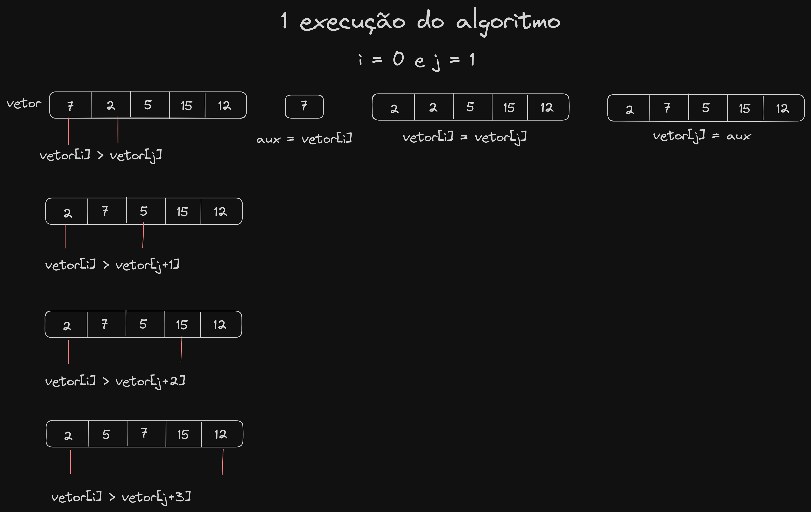

# Bubble Sort

 
    O Bubble Sort ou ordenação por flutuação é um algoritmo de ordenação que não retorna uma nova lista e possuí complexidade O(n²). A ideia básica do mesmo é iterar por um conjunto de elementos, a quantidade de interações é o mesmo tamanho desse conjunto e, a cada iteração, flutar para cima o maior valor desse conjunto.

